# End-to-end Retail Analytics on Snowflake

## Project Overview

This project demonstrates an end-to-end retail analytics data pipeline built using Snowflake, dbt, and Apache Airflow. The pipeline transforms raw retail data into a structured data warehouse using a Raw → Staging → Mart architecture, delivering analytics-ready data for business reporting and decision-making.

## Dataset

This project uses the *Global Electronics Retail Dataset* from *Maven Analytics*. The dataset represents a fictional global electronics retailer and includes information about sales transactions, products, customers, stores, and currency exchange rates.

## Business Requirements

1. Analyze the types of products sold and the geographic distribution of customers.
2. Identify seasonal patterns and trends in order volume and revenue.
3. Evaluate average delivery time and monitor changes in delivery performance over time.
4. Compare the Average Order Value (AOV) between online and in-store sales channels.

## Architecture

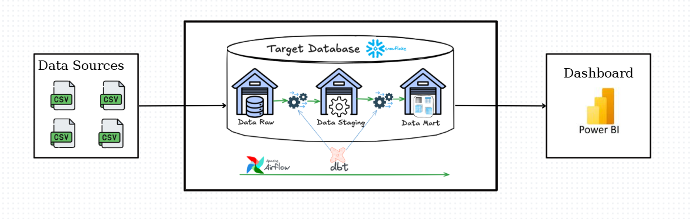

| Component | Responsibility | Why This Tool? |
|-----------|----------------|----------------|
| Snowflake | Cloud Data Warehouse | Designed for OLAP workloads with independent compute and storage, making it suitable for scalable analytics. |
| dbt | Data Transformation | Enables modular SQL transformations, testing, documentation, and lineage. |
| Apache Airflow | Workflow Orchestration | Automates and schedules the ELT pipeline. |
| Power BI | Data Visualization | Connects to Snowflake to build interactive dashboards and communicate business insights. |

## Workflow
1. Initialize the Snowflake environment by creating the warehouse, database, schemas.
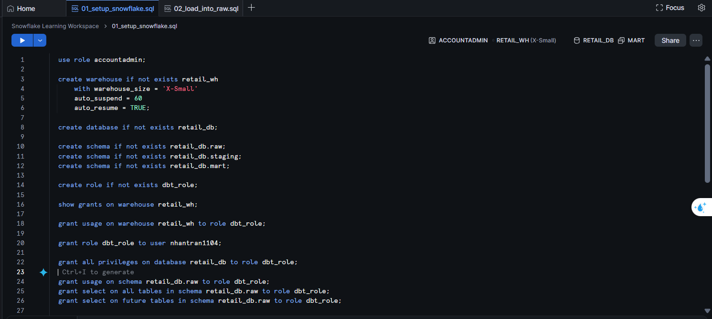

2. Upload CSV files to Snowflake Stage and load raw data into the Raw schema using COPY INTO.
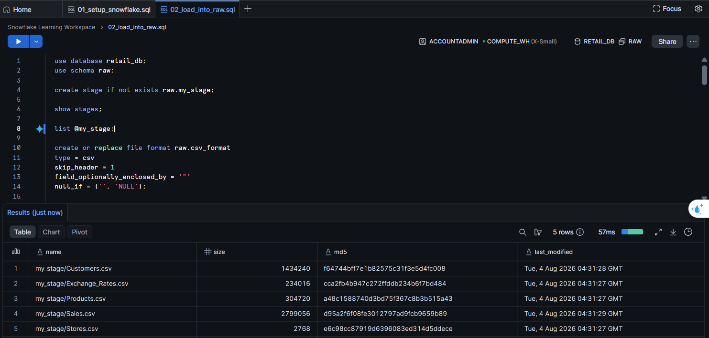
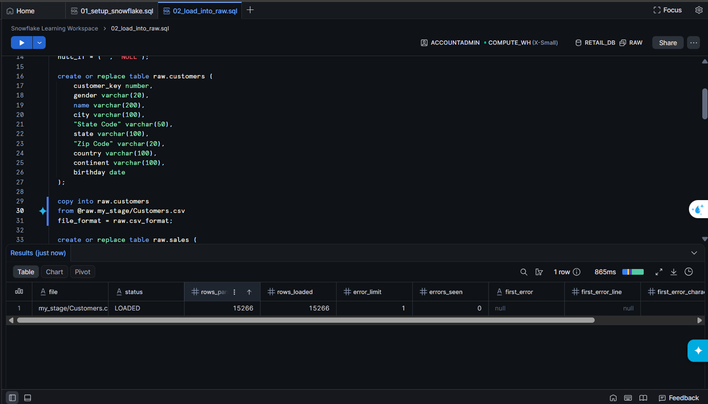
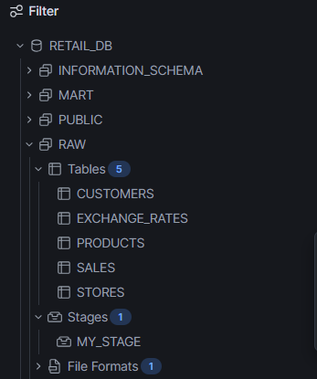

3. Use dbt to standardize, and validate raw data in the Staging layer.
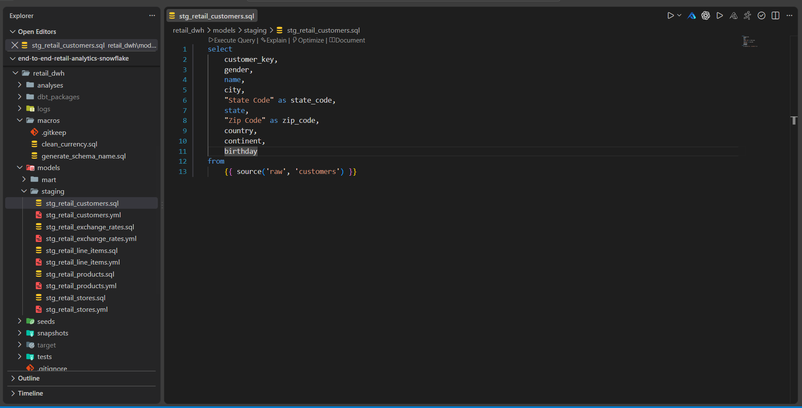

4. Build dimensional models following a Star Schema in the Mart layer.
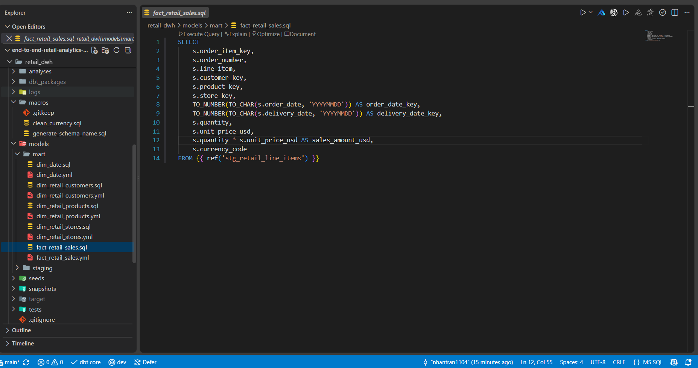
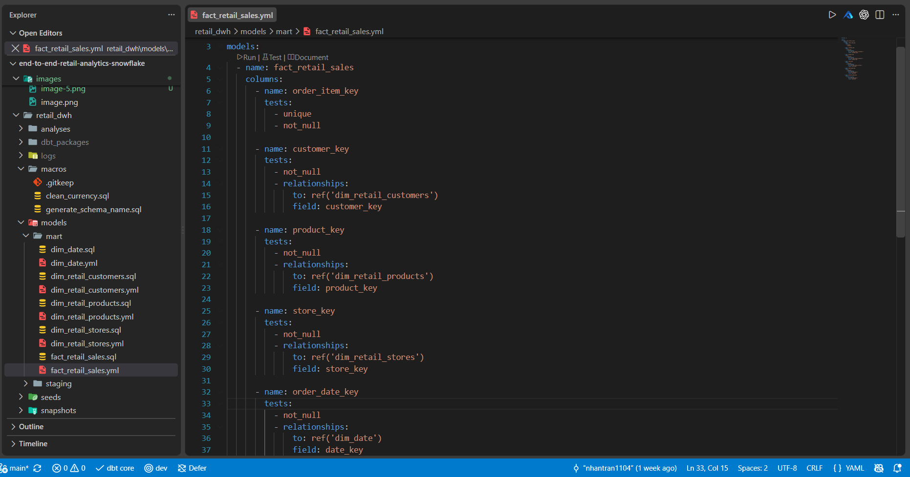

5. Configure an Airflow connection to Snowflake and Automate the ELT pipeline using Apache Airflow.
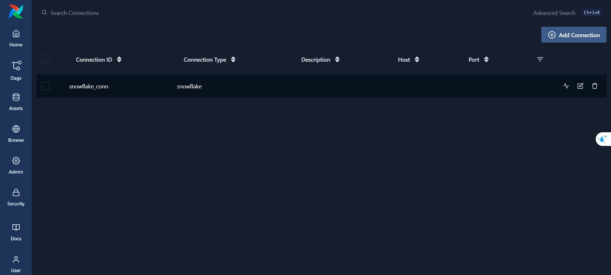
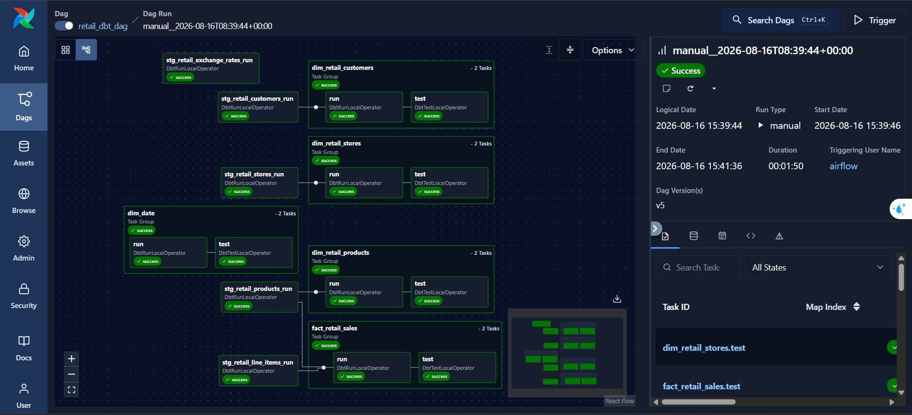

6. Connect Power BI to the Snowflake Mart layer to build interactive dashboards and visualize business insights.
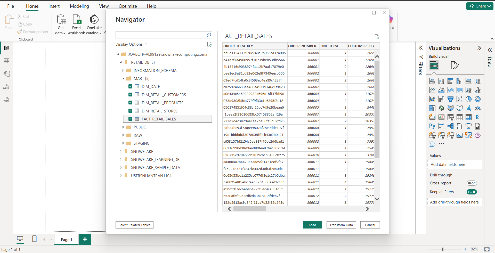

## Results
# Sales & Performance Overview Dashboard
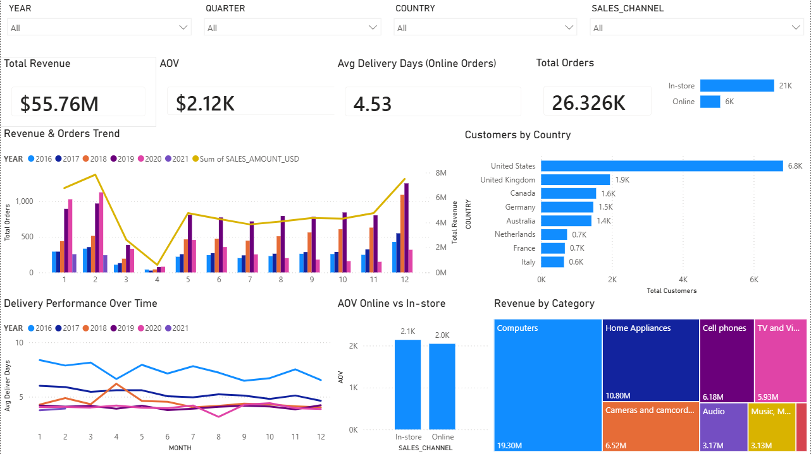
1. Product & Geography: Computers are the largest revenue-generating category ($19.3M), while the US is the dominant customer market with approximately 6.8K customers.
2. Seasonality: Sales show strong seasonal patterns, with revenue and order volume peaking around February and December, while April represents a significant low point.
3. Delivery: Average delivery time improved substantially over time, declining from approximately 8 days in 2016 to around 4–5 days in recent years.
4. AOV: In-store orders have a slightly higher AOV than Online orders (~$2.1K vs ~$2.0K), although the difference is only around 5%.